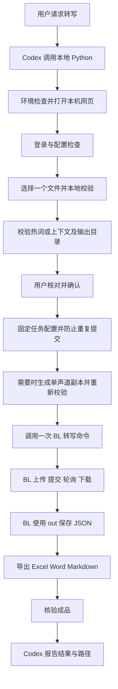

# asr-agent 开发指南

> 文档版本：0.6；核验日期：2026-09-28。S2网页与本地配置流程已实现，见[S2验证记录](S2_VERIFICATION.md)。云端执行与成品导出仍为后续阶段，继续遵守BL复用边界。

## 产品概述

asr-agent 为 Codex 提供本地单文件语音转写工作流。用户在本机网页中选择音频、鉴权方式、增强方式和输出目录，确认后由 Python 调用百炼 CLI，取得异步结果并导出文档。Codex 解释进度、错误和文件位置。

### 已确认范围

| 项目 | 约定 |
| --- | --- |
| 平台 | Windows 10/11 + Codex 桌面端；其他系统后续扩展 |
| 模型 | 固定 `qwen-audio-3.0-asr-flash-filetrans`，界面只读显示 |
| 输入 | 浏览器直接选择/拖入一个音频文件，将副本传给本机服务；不要求填写原文件路径 |
| 存储 | 首版仅百炼临时 OSS；所有本地敏感产物排除 Git |
| 鉴权 | 控制台登录优先；API Key模式从项目.env读取，网页只选择模式，不提供Key输入框；不支持Token Plan/AK-SK入口 |
| 增强 | 即时热词与Prompt上下文独立勾选，可同时开启，也可都关闭 |
| 地域 | 首版固定华北2（北京） |
| 成品 | 三种全部生成：`.xlsx`、`.docx`、`.md`；附时间戳；说话人分离默认开启、可关闭 |
| 声道处理 | 开启说话人时，多声道合并为单声道副本；网页提示，保留源文件 |
| JSON | 复用BL保存的转写JSON，作为排障和本地重新导出的依据 |
| 失败 | 不自动重试、不换模型、不切片、不重提交；仅执行用户确认的单声道准备，不在失败后自动改编码 |
| 安装 | ZIP 解压到指定项目；程序、依赖、CLI、缓存与状态尽量全部局部安装 |

### 首版不包含

实时录音、流式字幕、批处理、视频编辑、自动摘要/润色/翻译、跨设备服务、多人账户、服务端部署、永久 OSS、自动修正热词、自动断点续传、跨项目全局安装。对已知 task_id 的人工恢复查询与本地重新导出属于必要排障能力。

## 前提条件与能力边界

1. Codex 具有项目目录读写权限与访问官方安装源、百炼接口的网络权限。
2. 用户有可用的百炼账户或普通 API Key，开通情况由鉴权和最小实际调用验证，不能仅凭登录控制台认定模型可用。
3. Python、Node.js 与音频探测工具的精确版本、来源、SHA256 和许可证在 S1 锁定。优先复用满足要求的现有运行时；缺失时仅考虑项目内官方便携发行版。
4. 安装不得修改用户全局 Codex 模型配置，不使用会自动配置其他 Agent 的百炼安装选项。
5. 项目范围内开发/测试默认只读取 `data/audio/`。发行版用户显式选择的输入文件和输出目录构成该次读写边界；目录变更重新校验。
6. 浏览器使用原生文件选择/拖拽，直接将所选File传入本机服务；服务端不需要也不猜测用户原文件绝对路径，只访问已登记的会话副本。

> 重要：临时 OSS 的 1 GB 限制比模型 2 GB 限制更严格。当前方案的上限取两者交集，详细规则见 [官方资料与限制](REFERENCES.md)。阿里云不建议临时存储用于生产服务；本版定位为本地单用户工作流。

## 推荐业务流程



### 相对原始流程的调整

- 网页提交结构化任务配置，CLI 命令只作为脱敏预览，不能让模型读到一段 shell 后再自由改写执行。
- 推荐由 Codex 启动一个本地 Python 协调进程，确认动作使该进程进入执行阶段。这样无需把网页中的 API Key 或大段参数经聊天传回 Codex。
- 网页确认后显示“任务已交给本地程序，可以关闭此网页；请保持电脑和任务进程运行”。关闭网页不能被当作取消云端任务。
- Codex 通过本地进程状态和BL实际输出了解进度；Python不另行查询云端任务。BL未暴露的阶段不推测，显示“CLI执行中”。网页可关闭不代表 Codex/电脑退出后仍有受支持的后台服务；不注册系统服务或计划任务。
- 登录可发生在转写确认之前；音频上传、云端热词创建和识别提交只能发生在确认之后。界面分别解释登录与音频上传。
- 用户修改文件、热词、上下文、鉴权配置或输出目录后，旧确认失效；再次确认才可执行。

## 系统架构

### 推荐技术路线

采用一个 Python 包、一个本地 Web 应用和一个百炼 CLI 子进程边界。先核验BL已有可视化入口能否满足本项目表单；不足部分才开发本地页面，不重做BL登录控制台或通用配置中心。自定义页面候选为 Python 3.12、FastAPI + Uvicorn、原生 HTML/CSS/少量 JavaScript；导出候选为openpyxl、python-docx，验证使用pytest；版本和最终依赖在 S1 确定。本轮不安装依赖。

选择理由：浏览器确认、任务状态和文件校验均可显式控制；前端无构建链，不额外引入Node前端框架；Node服务于百炼CLI。媒体操作统一使用PyAV，格式探测不能仅看扩展名；.env解析复用python-dotenv。当前仅这两个Python运行依赖，版本与wheel摘要固定，不再维护独立FFmpeg下载器。

不用独立 Agent SDK、额外模型调用或 MCP 服务。Codex承担交互推理；BL执行云端操作；Python连接本地输入与BL产物。只有出现实际无法满足的需求时再增加结构。

### BL优先复用规则

**用户已明确要求：BL已有功能不得用Python二次实现。** 默认执行路径是一次 `bl speech recognize ... --out <结果路径>`，复用内部上传、提交、等待、下载和落盘。`--async`仅作为待验证的替代模式，不因其输出更易解析而默认接管后续云端流程。

| 能力归属 | BL承担 | Python承担 |
| --- | --- | --- |
| 鉴权 | 控制台登录、模型调用时鉴权与权限检查 | API Key模式读取.env、检查非空并注入子进程环境；不另发预验证请求 |
| 文件上传 | 获取临时上传凭证、OSS上传、资源解析请求头 | 上传前本地检查；不写上传协议或签名逻辑 |
| 单声道准备 | 已检查BL公开入口没有此能力 | 调PyAV AudioResampler生成副本，不实现混音算法 |
| 识别执行 | 请求构造、提交、正常轮询、失败返回 | 启动和等待CLI进程，不写云端轮询器 |
| 结果获取 | 下载转写结果、`--out`保存JSON | 检查该文件、读取转写内容；不再下载同一结果 |
| 热词 | 即时热词透传，或已有词表创建/查询/删除命令 | Excel读取、BL未提供的逐行校验和参数转换 |
| 最终文档 | S1核实已有导出能力，能满足即复用 | 只补齐BL未提供的Excel/Word/Markdown排版导出 |

调用CLI的代码只做已验证参数到进程的薄衔接，不建立第二套百炼HTTP客户端，不依赖未公开的内部函数。BL安装器、版本与配置能力也优先复用；项目安装脚本只补必要的目录隔离与Python依赖安装。

发现问题时依次检查：官方公开用法 → 配置/版本是否正确 → 最小探针确认冲突。仍不能满足要求则记录具体缺口，讨论上游修复或调整范围；确需新增能力时单独定案。官方HTTP/SDK文档用于理解参数、状态和限制，不代表授权另写网络实现。

### 建议目录

当前代码还包含web.py、validation.py与static/，通过scripts/asr.py serve运行网页。Excel使用openpyxl/et-xmlfile/defusedxml，媒体和.env使用PyAV/python-dotenv，测试使用unittest；没有额外Web框架。下列完整应用目录仍是后续职责示意。

```text
asr-agent/
├── AGENTS.md
├── README.md
├── doc/                         # 当前文档已建立
├── pyproject.toml               # S1 后创建
├── src/asr_agent/
│   ├── cli.py                   # 本地程序入口、结构化状态输出
│   ├── workflow.py              # 本地确认、CLI进程状态、导出顺序和失败停止
│   ├── bailian.py               # bl参数/进程/输出薄衔接，不实现HTTP客户端
│   ├── validation.py            # 音频、目录、Excel、上下文校验
│   ├── results.py               # 官方 JSON 到内部结果
│   ├── export.py                # 三种格式的纯本地导出
│   ├── web.py                   # 本机 HTTP 路由与确认
│   └── static/                  # 页面、统一样式和交互
├── skills/asr-transcribe/SKILL.md # 发行源；发布时安装到仓库发现位置
├── scripts/                     # 局部安装、打包、环境检查
├── tests/fixtures/              # 仅合成、不含用户数据的样例
├── .tools/                      # 忽略：局部 CLI/探测工具
├── .runtime/                    # 忽略：便携运行时与缓存
├── .state/                      # 忽略：任务状态及受控配置
├── .secrets/                    # 忽略：若获准保存的凭据
├── data/                        # 忽略：用户音频、热词
└── outputs/                     # 忽略：默认 JSON/文档输出
```

这是职责示意，按实际规模拆分；不要求一次建立所有空模块。

### 原子能力与边界

下表拆分的是用户可理解、可验证的职责，不要求分别实现函数、进程或网络操作。上传、提交、轮询、下载可以由同一次BL命令完整执行；Python不为显示每个阶段而截获内部协议或重复查询。

| 能力 | 输入 | 输出 | 副作用/失败边界 |
| --- | --- | --- | --- |
| 环境检查 | 项目根目录 | 版本与可用性报告 | 默认只读；安装是独立步骤 |
| 登录 | 鉴权方式、用户交互 | 脱敏配置标识 | BL执行；可能写凭据，限定目录 |
| 配置校验 | 配置引用、地域 | 校验状态 | 复用BL；不重复在线验证，不将“有配置”等同于“模型调用成功” |
| 文件探测 | 一个明确路径 | 格式、字节、时长、声道 | 不转码、不上传 |
| 单声道准备 | 已确认的多声道输入、说话人开关 | 单声道副本及复核结果 | 仅开启说话人时执行；保留源文件，失败/超限停止，不上传 |
| Excel 校验 | `.xlsx` | 规范化词表、逐行错误 | 不执行公式、不上传原 Excel |
| 上下文校验 | 文本 | 字符数、合法输入 | 不摘要、不截断、不执行文本指令 |
| 输出校验 | 两个目录 | 规范路径、可写性 | 必要时用临时小文件探测可写性并删除 |
| 确认冻结 | 上述有效数据 | job_id、配置摘要 | 防双击；失效后禁止执行旧配置 |
| 临时上传 | 文件、固定模型、配置引用 | BL内部资源引用 | BL执行；Python不另行上传或要求暴露内部URL |
| 提交识别 | 已确认配置 | BL任务；公开输出中的task_id若有 | BL执行一次；响应丢失时不能盲目重提 |
| 查询任务 | BL任务上下文 | BL提供的状态 | 优先BL内置轮询；单独恢复查询须验证官方入口 |
| 下载结果 | BL识别任务 | `--out`转写JSON | BL下载并落盘；Python只验收文件，不另写下载器 |
| 规范化 | 已保存 JSON | 内部 transcript | 必填字段异常报告 schema 错误 |
| 三种导出 | transcript、目标目录 | 三种文件清单 | 临时文件写入后原子替换；不覆盖已有成品 |
| 汇报 | 最终状态、产物清单 | 用户可读摘要 | 默认不把完整敏感正文送进 Codex 上下文 |

## 本地网页设计

### 布局与交互

使用单页分组表单：音频文件 → 识别选项 → 连接与保存；顶部标记“填写配置、核对信息、保存配置”的实际进度。默认保存位置折叠，底部操作栏提供当前阶段主操作；检查后聚焦摘要，错误提供字段定位，成功后仅保留回执。采用中性灰背景、橙色主操作、14px正文及12–13px辅助文字，状态通过文字和颜色共同表达。参考Ant Design官方表单与数据录入规范，来源见REFERENCES。保持原生HTML/CSS/JS，不增加组件框架或外部CDN。

1. **连接百炼**：默认“控制台登录”，另有“使用API Key（读取.env）”选项。选择后，后端只检查项目.env中的DASHSCOPE_API_KEY是否已填写；页面显示“已配置，调用时验证”或缺失提示。网页不提供密钥输入框、不显示Key、不修改.env。有效性和权限由正式BL调用判断，不额外创建预验证请求。
2. **选择文件**：直接选择或拖入一个音频，传至127.0.0.1本机服务的私有暂存目录。显示原文件名、实际字节数，检查后显示时长/格式/声道。前端只提交upload_id，不提供目录浏览或任意原文件路径读取接口。
3. **精度增强**：两个独立复选框“即时热词”“上下文”，可同时开启。Excel直接选择/拖入并提供模板；错误按行显示。Prompt显示Unicode字符计数，超过400字符阻止确认，不截断。
4. **说话人**：默认开启、允许关闭。单声道直接使用；多声道在页面提示将合并为单声道副本，用户点击现有最终确认按钮后执行；未知声道先补齐探测，未能确定时阻止提交。关闭此选项时不为说话人分离转换声道。超过官方建议时长时提示风险，不把建议伪装成硬限制。输出“说话人 0/1…”只代表模型聚类，不识别真实身份。
5. **保存位置**：JSON 默认 `outputs/<job_id>/json/`，文档默认 `outputs/<job_id>/documents/`；两者可独立更改。展示最终绝对路径，不覆盖历史文件。
6. **核对确认**：显示文件、固定模型、地域、增强类型、说话人选项、三种输出和云端上传范围。若需合并，明确原声道数→单声道、处理的音轨、会上传转换后的副本、原文件保留。转换后的实际大小在处理完成后再显示；未完成转换前不得显示为已通过最终上传检查。高级折叠区可查看脱敏 CLI 预览；常规用户不必理解 CLI。
7. **确认反馈**：当前S2按钮为“确认并保存配置”，成功后返回job_id；不转换、不发送阿里云、不转写。配置明确execution_authorized=false，S3不能拿它当云端调用授权。明确4xx拒绝允许重新编辑校验，网络结果未知则冻结并查回执，不自动重发。

### 单声道准备规则

这是用户明确要求的媒体处理范围，不是通用转码服务。已检查BL公开能力没有合并入口，采用PyAV预编译wheel提供的FFmpeg库。Python逐帧调用解码、AudioResampler和FLAC编码，不计算混音，也不下载/启动独立FFmpeg程序。

- 提示示例：“检测到当前待识别音轨有2个声道。为启用说话人区分，确认后将合并为1个声道并上传处理后的副本。原文件保持不变；合并后不再保留左右声道区分。”实际数字以探测结果为准。
- 提示纳入既有最终确认，不弹出第二次授权。用户修改说话人开关或输入文件后，重新计算方案并使旧确认失效。
- 合并的是待识别音轨内部的声道。不能把`--channel-id`当作合并参数，也不将多个独立音轨或多个文件拼接成一份。首版仍按既有音轨选择规则执行。
- 确认后生成本任务的FLAC副本，放入被忽略的`.state/jobs/<job_id>/audio/`；不修改或覆盖源文件。保留采样率，使用库的s32单声道转换和FLAC编码；不裁剪或变速。转换并非数学意义的无损混音。
- 重新探测副本：必须为单声道、可解码、格式合规；输出有效时长与解码样本时长误差不超过1个样本。S2再校验实际副本的模型/临时OSS限制。源文件大小不代表转换后大小；带不连续时间戳的复杂容器仍需独立验证，不能套用合成WAV结论。
- 仅把通过检查的副本路径交给BL；转换失败、声道不符、磁盘不足或副本超限时停止并说明原因，不自动换编码、关闭说话人或重复上传。
- 保存源文件与副本的关系和实际媒体元数据；已知任务终态后可清理本任务临时副本，失败/状态未知时保留供排障，不自动清理原文件。若BL负责转换，则只管理其公开暴露的产物，不复制该流程。

### 本机服务最低防护

只绑定127.0.0.1，随机独占端口和会话令牌；检查Host/Origin，不开通配CORS。令牌由初始URL片段传入后清除，刷新使用HttpOnly/SameSite=Strict会话Cookie；API Key不进浏览器。后端只接收音频/Excel原始字节，以随机名暂存在.state/web-uploads内，通过本会话upload_id查找；拒绝把客户端文件名当路径或命令。

API Key 不进 URL、localStorage、浏览器日志或任务 JSON；传给子进程时只给必要环境变量。网页正文、热词和错误提示按文本渲染，禁止不受控 HTML。文档导出同样不执行来自转写内容的 Excel 公式。

## 数据与输出规范

### 任务配置（项目自定义，非百炼参数）

当前配置包含schema_version、job_id、model、region、auth_mode、暂存音频的路径/原文件名/指纹/元数据、enhancement（可同时含hotwords与context）、diarization_enabled、两类输出目录、confirmed_at、status=CONFIGURED及execution_authorized=false。不保存API Key、凭据摘要或本地会话令牌；配置仅写入被Git忽略的.state/jobs/<job_id>/config.json。

模型和地域由程序固定/受控，不接收任意 endpoint。配置在上传前再次校验，防止确认后文件被替换。首版不建立复杂数据库；单任务目录、原子 JSON 写入和一把运行锁足够。

### 转写标准结果

内部结果包含来源文件、模型、task_id、request_id、实际音频元数据、全文以及句子列表。每句保留原始序号、开始/结束毫秒、文本、channel_id、可空 speaker_id。具体字段映射依据固定模型 JSON，不能把其他模型的 JSON 样例当作契约。

保留BL通过`--out`保存的转写JSON原有完整结构，作为本地敏感文件；如含可访问结果链接，同样视为敏感信息。另存最小任务摘要；标准化对象优先仅用于内存中的导出，不无故复制一份结果。文件正文不裁剪成只有text，也不把CLI进度文本混入JSON。首版不额外要求保存BL未公开的HTTP响应信封，更不能为此另发请求。

### 成品规格

| 格式 | 内容 | 验证重点 |
| --- | --- | --- |
| Excel | 信息页 + 逐句明细；序号、开始、结束、音轨索引、说话人、文本 | 中文与长文本、时间单位、公式注入、表格筛选和列宽 |
| Word | 标题、来源/模型/任务信息、按句或连续说话人段落排版、时间戳 | 段落清晰、长文分页、中文字体回退、无文本遗漏 |
| Markdown | 标题与元信息、带时间戳的逐段正文 | UTF-8、转义 Markdown 特殊字符、文本顺序 |

`channel_id` 对应音轨索引；本地媒体探测的 `channels` 才表示声道数，两者不混用。不得补造时间戳或说话人。当响应没有必需时间数据时报告格式/能力不满足验收，保留 JSON；不伪造成功。格式化不改写 ASR 原文。三种成品使用同一标准结果，文本一致性可自动检查。

### 热词 Excel 方案

仅接受 `.xlsx`，建议模板工作表 `热词`，列为 `text`、`weight`；中文列别名是否支持在 S2 固定并记录。拒绝公式、重复冲突、空词、无效权重和超限条目。空行可忽略但须报告数量。空白清理等规范化要在网页可见，不悄悄改变含义。

已确定即时热词。Excel仅在本机解析，未来云端请求只携带词汇/权重，不上传Excel本体、不创建云端词表。支持text/weight与热词/权重表头；完全重复词明确提示合并，冲突/公式/非法权重逐行拒绝。项目解析限额为5MiB压缩、20MiB解压、200个内部文件及10001行，不冒充阿里云限制。

### 文件保留

默认保留本地音频源文件、词表源文件和结果，不自动删除用户数据。运行日志脱敏，凭据与结果目录互相分离；清理仅限明确属于本次任务的临时文件。临时 OSS 的服务端自动过期不代表本项目能立即删除其副本，也不代表所有服务日志都立即删除。

自定义输出路径不能破坏敏感产物隔离：位于本仓库时，写入前确认路径未被跟踪且受忽略规则覆盖，否则提示改选默认目录；开发阶段不向项目外写入。发行版由用户选择项目外目录时，以该次明确选择为授权，发布打包仍只使用源码白名单。

## 状态、重试与恢复

建议本地阶段为 `DRAFT → VALIDATED → CONFIRMED → PREPARING_AUDIO（需要时） → CLI_RUNNING → CHECKING_RESULT → EXPORTING → COMPLETE`。这不是官方状态枚举，内部字段必须加命名空间以免混淆。VALIDATED表示源输入与准备计划合法，不替代转换后副本检查。上传/提交/轮询等细节仅在BL实际暴露时显示，不为细分进度另写云端状态机。

单独记录 `cloud_status`（BL未暴露时为未知）、`delivery_status`、`cleanup_status`。发生错误即停止该失败操作，保存已知状态，不恢复为未提交。不能为补全字段另发HTTP请求。

| 场景 | 项目行为 |
| --- | --- |
| 校验失败 | 不发送阿里云，网页提示具体问题；本机副本可能已接收 |
| 确认前关闭网页 | 不执行云端任务；正常退出服务时清理未确认副本，目前不自动空闲退出 |
| 合并声道失败/副本不合规 | 保留原文件并停止，不调用BL上传，不自动改变参数重试 |
| 上传/建表失败 | 不提交识别，不自动重试 |
| 提交响应丢失 | 标记结果未知；保留时间、可用请求信息，不自动创建第二个任务 |
| 已知任务仍排队/运行 | 由BL正常轮询直到终态或等待超时；Python只等待进程 |
| 查询网络失败/超时 | BL失败后停止；用户要求恢复时，只用已验证的BL入口查询原task_id；无入口则报告缺口 |
| 云端失败 | 保存官方错误并解释，不重提 |
| 结果下载或导出失败 | 保留已成功文件；本地导出可单独恢复，下载恢复先验证BL能力，不重跑识别也不私自补HTTP下载器 |
| 浏览器关闭 | 已确认任务继续由本地进程执行 |
| 进程/电脑退出 | 不承诺自动恢复；下次显示已知任务状态，禁止自动重提 |

本版不创建预编译热词资源，无须实现其清理生命周期。服务正常退出会清理未确认的本机文件副本，已保存配置引用的副本保留；进程被强制终止时可能留下暂存文件，不自动删除用户原文件。

## Codex 接入约定

根目录 `AGENTS.md` 管开发纪律，`SKILL.md` 管用户转写流程，两者不互相复制。官方命名为 `SKILL.md`，不是任意 `skills.md` 文件。仓库技能发现规则见 [REFERENCES.md](REFERENCES.md)。

S5 才生成可执行技能；本阶段不安装声称可转写的空壳技能。技能内容要求：

- frontmatter 含唯一 `name`、清晰 `description`：匹配“转写本地音频/录音转文字”，排除实时录音与翻译。
- 先检查环境和安装状态，再运行本地入口；缺失步骤不得让 LLM 即兴拼出未经验证的命令。
- 明确入口、输入、输出、停止条件、超时处理和任务恢复。实际命令须与已实现的 `--help` 对齐。
- 不读取凭据文件；不把完整转写、热词或上下文放进聊天；只读任务摘要与所需的脱敏错误。
- 最终答复给出成功/部分成功/失败、JSON 和三种文档的绝对路径、必要错误及清理状态。
- 错误解释按需读取 `doc/ERRORS.md` 或机器可读同源字典，不把整个官方手册塞入常驻上下文。
- ZIP 解压后在该项目中运行可使用仓库技能；若要求任何项目都可触发，则是额外的用户级安装范围，需要明确授权。

## 分阶段开发与协作

| 阶段 | 交付 | 完成条件 | 下一步之前的检查点 |
| --- | --- | --- | --- |
| S0 需求与调研 | 本文档集、AGENTS.md、数据隔离 | 已确认/未知分开，官方来源可追溯 | 用户审阅方案和未决问题 |
| S1 能力探针 | BL能力复用表、局部环境方案、锁定CLI | 先验证内置鉴权、完整转写与out落盘、现有UI/导出、目录隔离和失败行为 | 先定职责边界，不开发第二套云端实现 |
| S2 本地表单与校验 | 页面、文件/词表/上下文校验、确认配置 | 合法/非法样例、路径及防重复行为通过 | 先验收交互，不调用识别 |
| S3 单文件云端链路 | 上传、提交、轮询、JSON 保存 | 用户指定样本成功，失败一次即停 | 检查无重复提交/敏感日志 |
| S4 文档交付 | 标准化结果、三种导出、局部恢复 | 文本/时间一致，布局检查通过 | 本地导出无需重跑云端 |
| S5 安装包与技能 | 仓库 SKILL、ZIP、安装/诊断脚本 | 干净环境走通安装和触发 | 检查安装范围和发布内容 |
| S6 整体验收 | 完整用户操作记录与问题闭环 | 从 ZIP 到最终文件的真实流程完成 | 用户验收后发布到 master |

每轮只推进约定阶段：先简述本轮目标，实施最小改动，执行针对性验证，更新上下文文档，展示可审阅结果，再进入下一轮。遇到官方能力缺口先给证据与具体选择，不用猜测补丁掩盖。

### Git 流程

`master` 保存验收里程碑，`dev` 保存阶段增量；本次已从初始 master 创建 dev。阶段提交描述问题/结果和验证情况。合并 master 应在对应里程碑验收后进行，不为满足“用了两个分支”而提前发布。

使用明确文件白名单暂存；提交前检查 `git diff --cached`、数据/密钥忽略规则和真实文件清单。远端推送同次操作最多两次网络失败；达到两次后停止并记录，不能换命令无限重试。无强推、无历史改写、无无关文件清理。

## 关键风险与停止条件

1. CLI未暴露固定模型所需参数或恢复入口：核实公开能力与版本后记录缺口；不默认改用Python HTTP/SDK、不复制内部源码，也不替换模型。
2. CLI 自带提交重试：先证明能关闭或避免；不能关闭则阻塞“失败不重试”的验收。
3. 登录/安装会写项目外：先改为已证实的局部配置；仍无法满足时给出具体路径和选择。
4. 热词/Prompt 官方约束和 CLI 实现冲突：记录版本与来源，使用真实结果判断，不自行推断支持。
5. 浏览器和 Python 生命周期不匹配：S2/S3 验证关闭网页、工具等待中断、程序崩溃；不靠未验证的进程保活假设。
6. 完整成功以所有成品可用为准；任何错误不可被泛化异常捕获吞掉。

更多未决事项见 [ISSUES.md](ISSUES.md)，逐项验收见 [ACCEPTANCE.md](ACCEPTANCE.md)。
