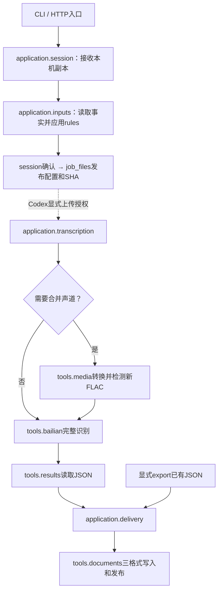

# 开发说明

配合[UML设计视图](UML.md)查看对象、实际调用顺序和失败状态；图中附有对应源码位置。

## 业务与依赖边界

模型固定qwen-audio-3.0-asr-flash-filetrans、北京、单文件及临时OSS。网页只添加本机文件、预览和确认配置；Codex按授权调用独立CLI执行，失败不自动重试。BL负责鉴权、上传、提交、轮询、下载和原JSON落盘。

多步骤用例按“入口→application→tools”组织；登录、凭据状态和热词模板等单一工具操作允许入口直接分派，不为经过application增加转发函数。共享models只放不可变数据，不引用业务、工具或第三方库。tools包含外部能力适配和项目专用的文件协议，不是只放通用函数的目录；不反向引用application或web。执行状态的转移由用例决定，job_files负责记录格式与读取边界。没有BaseTool、writer基类、DI容器、数据库或通用Repository。

```text
src/asr_agent/
├── __main__.py、web.py        # CLI与HTTP入口
├── models.py                 # AudioInfo、Sentence、Transcript、HotwordRow
├── application/
│   ├── bootstrap.py、diagnostics.py
│   ├── session.py
│   ├── inputs.py、rules.py
│   └── transcription.py、delivery.py
├── tools/
│   ├── environment.py、auth.py、bailian.py
│   ├── files.py、job_files.py、hotwords.py
│   ├── media.py、results.py、documents.py
│   └── directory_picker.py、_directory_dialog.py
├── static/                   # model、view、app、api及页面样式
└── error_catalog.json
```

## 模块职责

| 模块 | 唯一职责 |
| --- | --- |
| __main__.py / web.py | 命令或HTTP协议分派、输入输出转换；网页确认向同一serve进程输出回执 |
| application/bootstrap.py / diagnostics.py | 安装顺序与复用，doctor诊断报告，公开CLI合约探针 |
| application/session.py | 会话状态、上传登记/发布、目录批准、预览与确认生命周期 |
| application/inputs.py | 调用文件、媒体、Excel工具，再应用规则，形成预览及字段错误 |
| application/rules.py | 固定模型限制、语言/人数/上下文规则、从热词行形成词典；不执行I/O |
| application/transcription.py | 授权、一次执行、状态转移、必要转换、BL调用、结果与交付编排 |
| application/delivery.py | 独立导出轮次、三格式调用、部分成功与用户解释 |
| tools/environment.py / auth.py | 项目路径、隔离环境、普通进程与依赖事实；唯一.env解析 |
| tools/bailian.py | 公开CLI命令和参数映射、BL安装事实、进程、登录链接转交、错误脱敏 |
| tools/files.py | 文件身份、轻量变化检查、唯一原子状态JSON写入 |
| tools/job_files.py | 任务目录、确认配置及SHA发布/读取、执行占用、执行/交付记录与输出位置协议 |
| tools/hotwords.py | 唯一Excel读取及模板生成，文件结构和解析资源限制 |
| tools/media.py | PyAV媒体事实与单声道FLAC处理，调用者决定何时转换 |
| tools/results.py | 唯一官方结果JSON读取、结构检查与内容摘要 |
| tools/documents.py | 三种普通writer、共享标题/时间/标签、Office回读及成品发布 |
| tools/directory_picker.py / _directory_dialog.py | 原生窗口、取消、子进程与返回协议 |
| static/model.mjs / view.mjs / app.mjs / api.mjs | 交互状态与权限、DOM、Presenter编排、唯一HTTP传输 |

Project包含文件系统行为，留环境工具；PreparedCommand仅BL使用，留BL工具。Session和DirectoryPicker有真实生命周期，保留类；无状态工具使用模块函数。

## 执行流程



配置确定选项、词典与上下文；Key是执行时凭据；音频是实际读取的文件。三者不在每个步骤重复绑定校验。

## 校验与复用

| 阶段 | 实际工作 |
| --- | --- |
| 上传 | 本机协议、会话与用途、字节完整性；不上传云端 |
| 预览 | 探测音频一次并建立SHA；Excel解析一次，规则形成词典；检查选项和输出批准名单 |
| 确认 | 复用draft，只核对音频路径及size/mtime；不读Key、Excel或全SHA |
| 执行 | 先读取确认配置协议/摘要，再创建永久一次执行占用并保存PREPARING；随后核对实际音频size+SHA、运行凭据和参数，进行必要转换，最后调用BL |
| 转换 | 使用已确认AudioInfo，检查转换期间变化及新FLAC；不再probe源文件 |
| BL | 统一recognition_arguments映射、prepare_command准备argv/环境；运行Key只读一次 |
| 重导 | 核对确认配置、已保存的JSON_READY执行记录和结果JSON摘要；不读旧交付或重新识别 |
| 成品 | writer分别保存；Excel/Word回读，Markdown安全编码；不计算无人消费的成品SHA |

热词快照保存词典、数量和提示；网页文件名来自上传登记，执行使用已确认词典。文件工具错误由输入用例翻译成字段提示，工具不反向依赖业务异常。

write_json_atomic是唯一状态原子写入实现，执行与交付共用。确认配置使用独占新建、先保存同一字节摘要再发布的两文件协议，由job_files维护。JSON协议的读取也由job_files负责，业务只决定状态及更新时间。

read_api_key、file_fingerprint、check_audio_limits、load_transcript及三writer的标题/标签/时间格式继续直接共享。对已在内存的配置/结果字节直接算SHA，不为复用额外读取文件。

普通run_process、BL进程和GUI进程保留不同生命周期；不合成为带多模式/回调的通用执行器。没有第二套云客户端，也不修改BL源码。

增强内容的参数边界集中在recognition_arguments：vocabulary经JSON序列化形成单个值，上下文绑定为单个`--context=<原文>`。该绑定处理BL 2.1.0对独立--help/--version及--前缀参数的解析行为，Windows引号与反斜杠交由subprocess处理。版本依据与传递保真范围见[REFERENCES](REFERENCES.md)。

## 同步与文件生命周期

Session普通Lock维护pending、uploads、draft、receipt及关闭状态。上传短锁登记、锁外接收、短锁发布；同类并发拒绝，关闭后的迟到结果不可发布。目录选择器有自己的短锁/取消Event，取消不等待会话I/O；没有用户选择总期限。

保存未知时前端冻结，明确4xx拒绝才恢复。输入变化通过revision使旧预览失效；确认不重复检查同次Key状态。普通表单留DOM，Key不入Model或配置。

输出只接受固定outputs或本类别原生选择登记的精确路径。原生返回核对目录，Session试写一次；预览再检查实际选定目录，没有旧自由文本路径规则。

关闭浏览器不关闭服务。正常服务退出保留已确认音频，其他副本可清理；强制退出不承诺恢复。execution目录成功、失败、崩溃后都不自动删除重跑。

一次执行从本地准备开始计入；缺Key、媒体转换失败等未启动BL的情形也占用该job。它保证同一job最多尝试一次，不保证云端恰好执行一次。结果未知时保持停止；是否允许已证实未启动BL的任务显式修复后继续，是尚未采用的产品方案。

| 数据 | 位置 |
| --- | --- |
| Key及BL配置 | .env、.state/bailian |
| 暂存输入 | .state/web-uploads/会话ID/ |
| 配置 | .state/jobs/job_id/config.json及config.sha256 |
| 执行记录 | .state/jobs/job_id/execution/status.json |
| 原JSON | 已选根目录/job_id/json/transcription.json |
| 导出记录 | .state/jobs/job_id/exports/导出编号/status.json |
| 成品 | 已选根目录/job_id/documents/导出编号/ |

JSON_READY仅表示原JSON结构通过。文档失败不改写云端结果，单格式失败仍尝试剩余格式一次。当前调用返回本轮交付，job-status另查最近轮；不依据退出0推断三成品完成。

执行记录写入只尝试一次，失败以record_error附在本次回执中，不掩盖已取得的JSON或原始执行错误。PREPARING/RUNNING写入失败时尚未调用BL，返回not_started；成功JSON记录写入失败时保留result_received及摘要，停止于本地导出之前。异常用固定phase和必要error_type定位，不输出第三方异常中的私有正文。json_path在运行前确定，解析成功后不再重复探测文件存在性；是否有效由JSON_READY判定。

函数说明使用简短中文动词句，直接描述动作和结果，例如“读取并校验热词Excel，返回即时词典和导入提示”。Python命名函数/方法使用docstring，JavaScript使用函数前注释。调用者需要的返回约定随简介保留；实现原因和约束放在相关代码旁，匿名短回调由所属操作说明。注释修改与执行逻辑修改分别核对。

此处参考[Google Python风格指南的函数文档与行内注释规范](https://google.github.io/styleguide/pyguide.html#38-comments-and-docstrings)：函数文档面向调用语义，实现细节按需在代码旁解释；简单接口可以使用单行说明。项目继续采用统一的中文说明和既有代码结构。

## 资源定位与发行

__main__.py保持包根位置推导项目目录。tools/bailian从包根读error_catalog.json；两个原生窗口模块相邻；web仍从包根定位static。没有扩大搜索范围或保留旧模块转发壳。

scripts/build_zip.py使用固定逐文件清单，不扫描目录。运行模块、静态页面及错误字典，源码入口、依赖锁、Skill、LICENSE和.env.example进入包；根README.md/README.en.md、AGENTS.md/AGENTS.en.md及.gitignore来自release中的明确模板映射。doc中仅包含HELP、ERRORS、REFERENCES。

中文AGENTS.md是指令入口，AGENTS.en.md为同一规则的英文对照；维护时同步，避免形成两套规则。仓库中英文README各保留overview、enhancement、outputs三个HTML注释占位，等待用户提供真实截图；注释给出建议文件名和配文，不引用尚不存在的图片。截图属于仓库展示材料，当前发行清单未收录。

tests、构建器、pyproject和开发文档只在仓库维护；环境、下载文件、凭据、数据、结果及日志不发布。新增运行文件须同步清单和静态路由，内部Markdown链接必须在包内存在。

```powershell
python -S -X utf8 scripts/build_zip.py
.venv\Scripts\python.exe -X utf8 -m unittest discover -s tests -t . -v
node --test tests/test_frontend.mjs
```

打包入口同名ZIP不覆盖。验证方法和未覆盖范围见[ACCEPTANCE.md](ACCEPTANCE.md)，使用步骤见[HELP.md](HELP.md)。历史凭据及验收产物保持清空，完整独立对话使用需重新验收。
