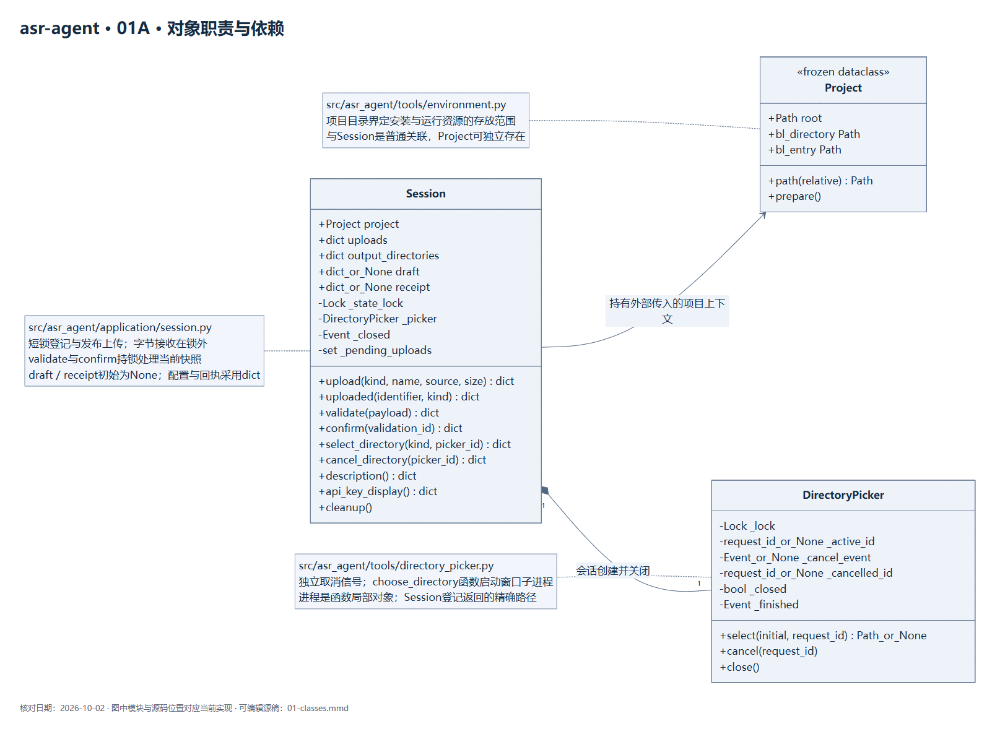
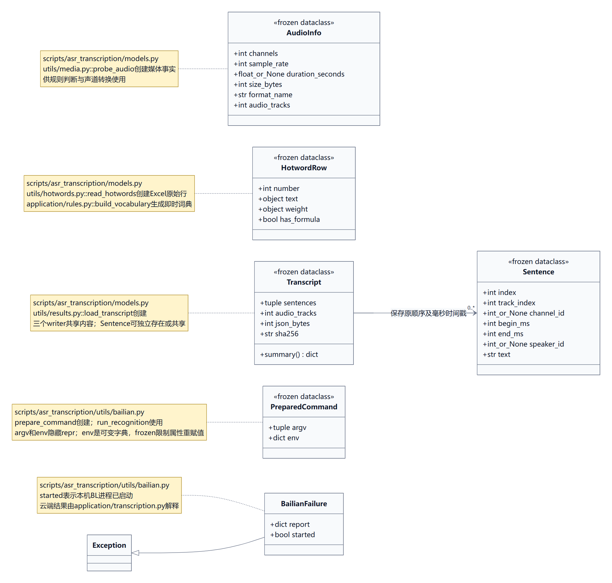
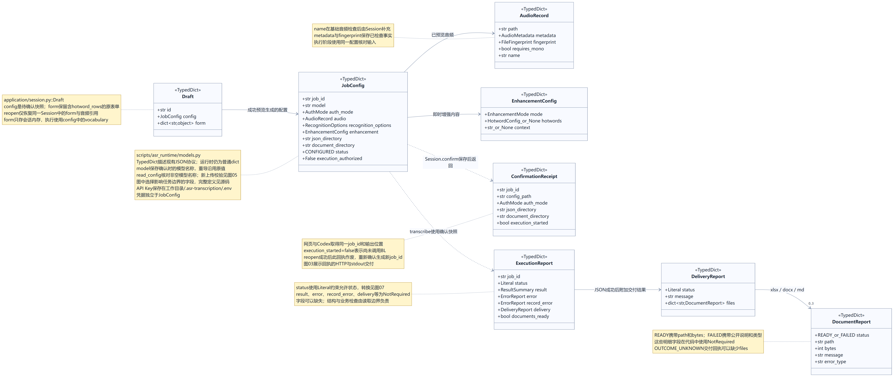
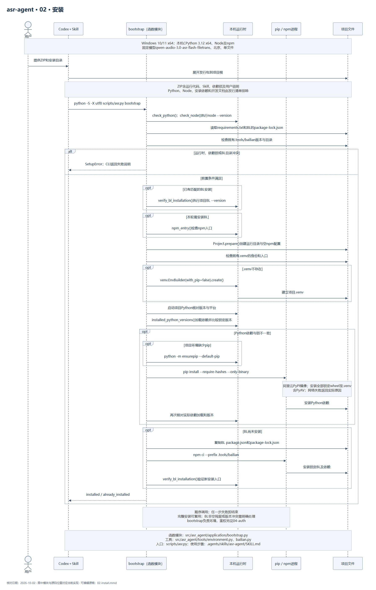
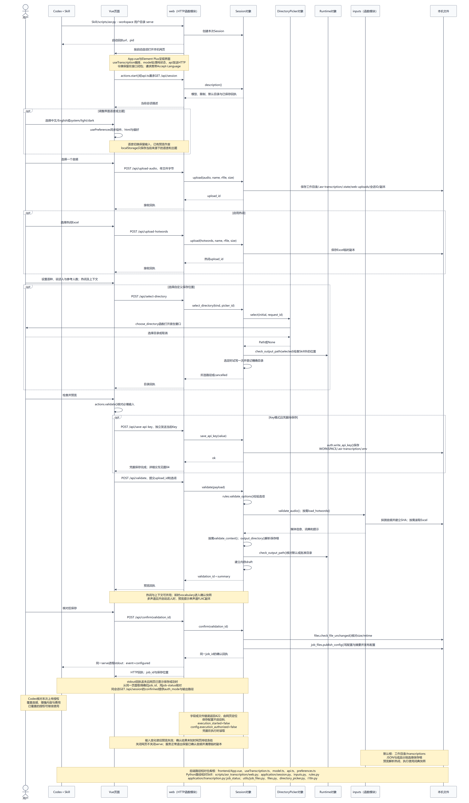
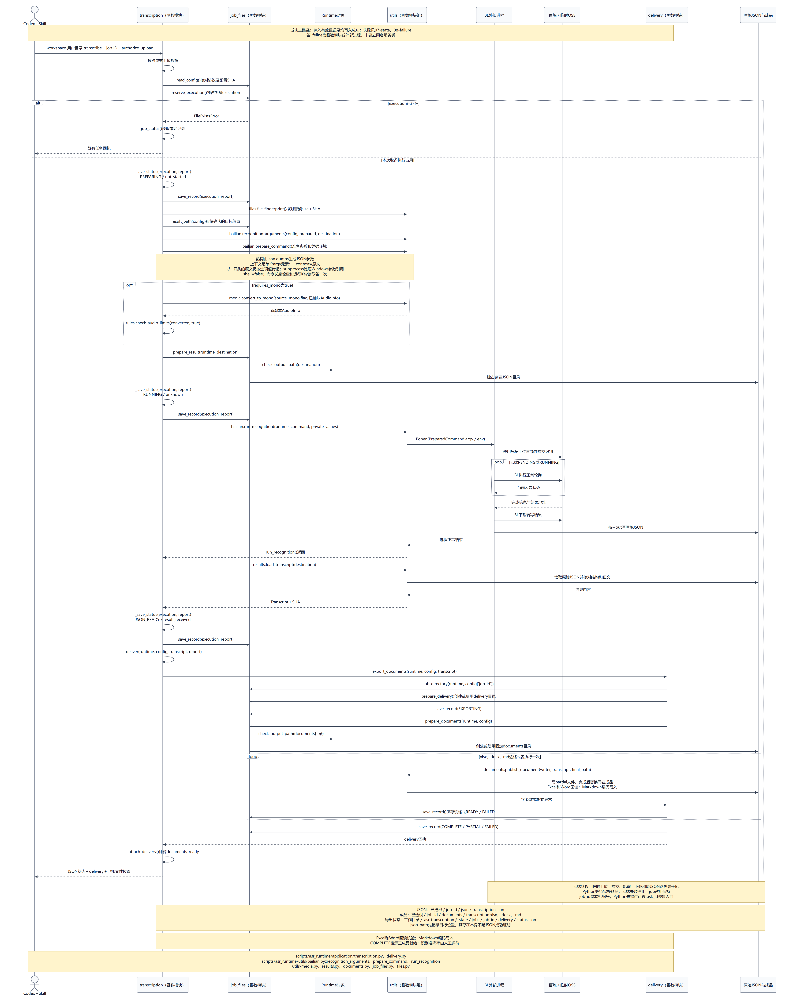
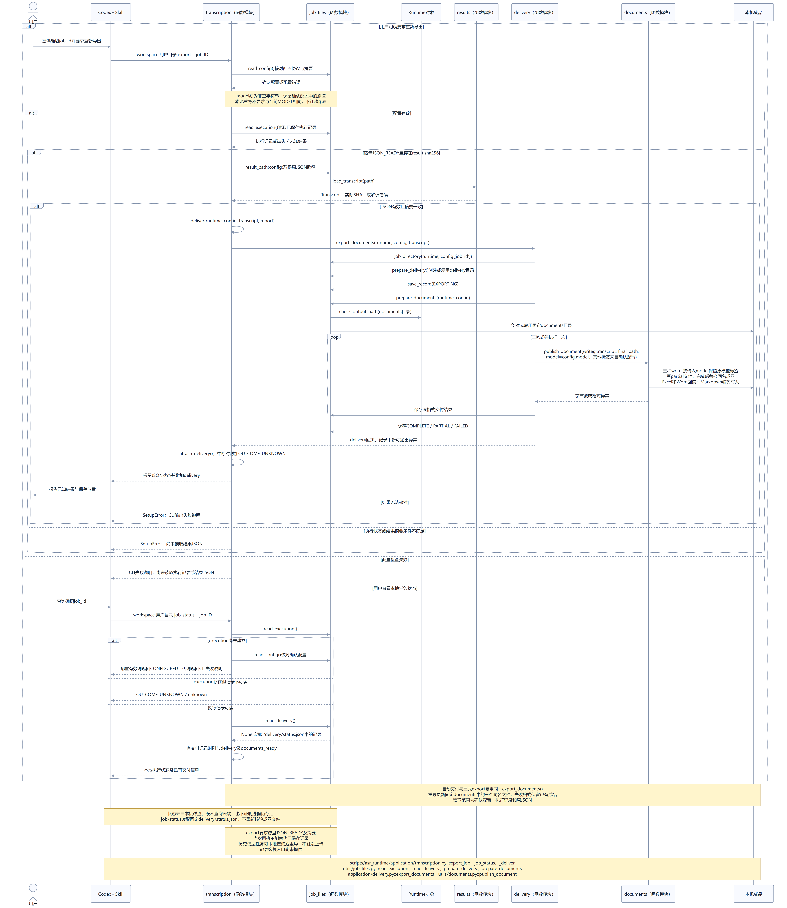
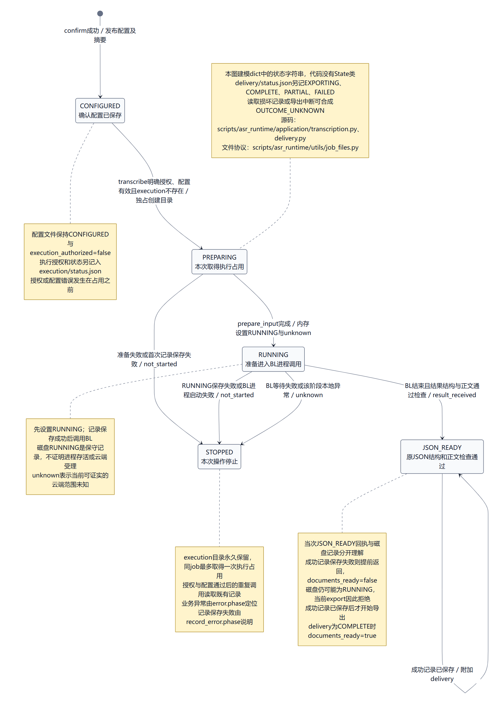
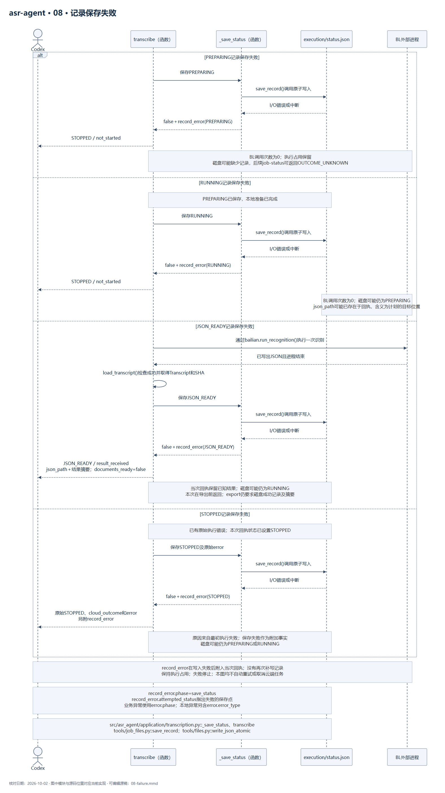
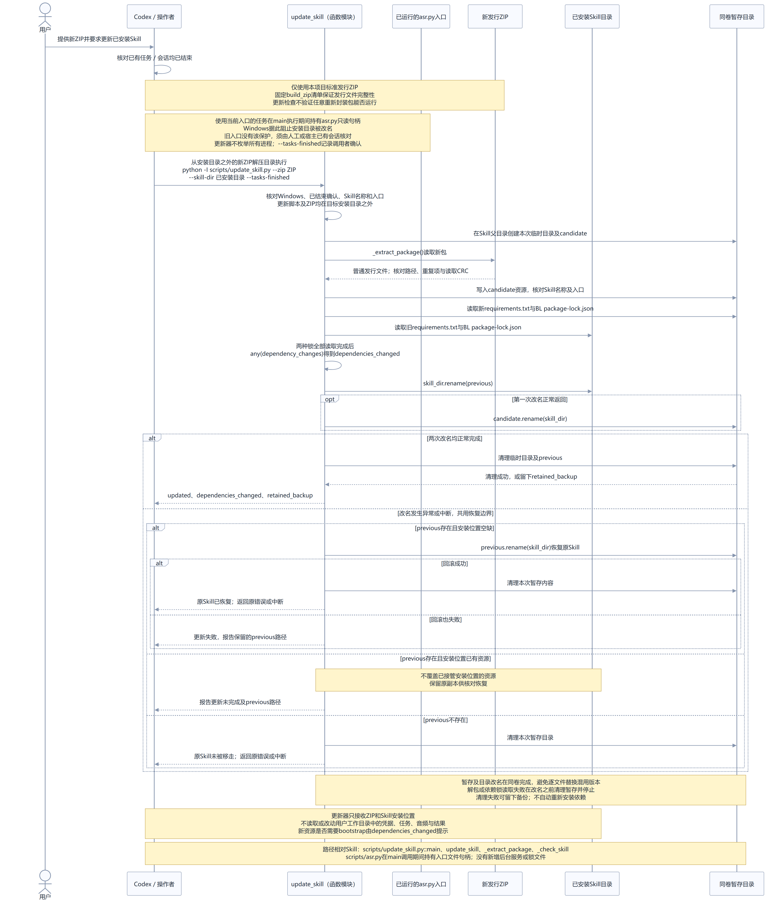

# UML 设计视图

本页只描述 MemoFlow 已实现的第一阶段：`asr-transcription` Skill 将录音转写为三种校对文档。会议纪要生成及反馈学习属于第二阶段规划，图中对象、接口和状态均对应当前代码。

核对日期：2026-10-04。图中以 `scripts/` 开头的 Python 位置相对于 `skills/asr-transcription/`；`application/`、`utils/` 等简写相对于其中的 `scripts/asr_runtime/`。前端 `frontend/` 路径相对于仓库根。`Runtime` 区分只读 Skill 资源与用户工作目录；时序图中的组件与函数模块使用生命线表示调用参与者，状态图描述回执中的状态字符串。

图稿使用 Mermaid 11.12.0 渲染；PNG 供直接阅读，`.mmd` 为可编辑源稿。修改调用顺序、资源边界、文件协议或状态语义时同步源稿与渲染图。本页和图稿属于开发文档，不进入 Skill ZIP。

安装相关视图包含实际的`PythonIndex`数据对象、来源测速、锁定pip准备、有限下载恢复、从本机wheel安装和进度输出。它们与云端转写的一次执行约束分别表达；其余视图描述现有配置、转写与交付协议。

本机配置图描述监听后打开URL并交给用户操作，正常路径不执行页面自动检查；BL授权属于保存配置后的步骤，只使用系统默认浏览器。

图01描述实际对象与数据协议；`HotwordRow`是可编辑的TypedDict，`Draft`同时保存确认配置与会话表单。图03包含Excel导入、直接编辑、统一词表校验及保存后重新修改：`reopen`与`transcribe`竞争同一个执行目录，撤回成功后旧任务保持停止，重新确认生成新编号。图07对应这条状态分支。

图01C列出确认配置中的`model`；图05在取得执行占用前核对它与当前固定模型`qwen-audio-3.1-asr-flash-filetrans`一致。图06允许历史模型任务本地查询和重导，三种文档显式使用确认配置中的模型标签，不迁移配置或隐式更换模型。

图04区分两种凭据来源，并描述首次登录的桌面权限、受限令牌检查，以及完整授权URL仅打开一次的调用边界；BL仍负责授权回调和凭据保存。图09描述Skill资源更新、目录替换与回滚；入口文件句柄只保护采用当前入口的运行任务，旧入口仍需人工或宿主会话核对。

| 视图 | 图像 | 可编辑源稿 |
| --- | --- | --- |
| 01A 对象职责与依赖 | [查看](uml/01-classes.png) | [源码](uml/01-classes.mmd) |
| 01B 共享数据与进程契约 | [查看](uml/01b-data.png) | [源码](uml/01b-data.mmd) |
| 01C 确认配置与交付回执 | [查看](uml/01c-protocol.png) | [源码](uml/01c-protocol.mmd) |
| 02 准备工作目录 | [查看](uml/02-install.png) | [源码](uml/02-install.mmd) |
| 03 本机配置 | [查看](uml/03-configure.png) | [源码](uml/03-configure.mmd) |
| 04 凭据来源与登录 | [查看](uml/04-auth.png) | [源码](uml/04-auth.mmd) |
| 05 转写与交付 | [查看](uml/05-transcribe.png) | [源码](uml/05-transcribe.mmd) |
| 06 重新导出与状态查询 | [查看](uml/06-export.png) | [源码](uml/06-export.mmd) |
| 07 本地状态 | [查看](uml/07-state.png) | [源码](uml/07-state.mmd) |
| 08 记录保存失败 | [查看](uml/08-failure.png) | [源码](uml/08-failure.mmd) |
| 09 更新Skill资源 | [查看](uml/09-update.png) | [源码](uml/09-update.mmd) |

## 01A 对象职责与依赖

## 01B 共享数据与进程契约

## 01C 确认配置与交付回执

## 02 准备工作目录

## 03 本机配置

## 04 凭据来源与登录

## 05 转写与交付

## 06 重新导出与状态查询

## 07 本地状态

## 08 记录保存失败

## 09 更新Skill资源

